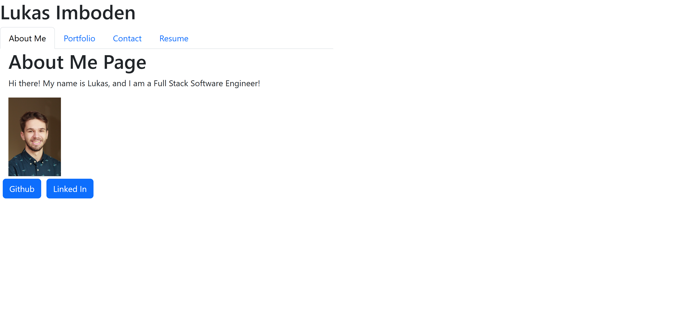

# Portfolio Website

## Table of Contents:
- [Description](#description)
- [Installation](#installation)
- [Usage](#usage)
- [Contributing](#contributing)
- [License](#license)

## Description:
a Website that shows who I am and the projects I've made

## Installation:
nothing

## Usage:
you can access the website here: [here!](https://bright-mandazi-ddb000.netlify.app/)

## Contributing:
You could clone my project and use it for your own portfolio!

## Tests:
none

## License:
This project is under the 'MIT' License.
Learn more about this License [here!](https://opensource.org/licenses/MIT)

## Questions:
- [Github!](http://www.github.com/limboden)
- [Email me!](mailto:imbodenlu@gmail.com)

### Thank you for reading me!
